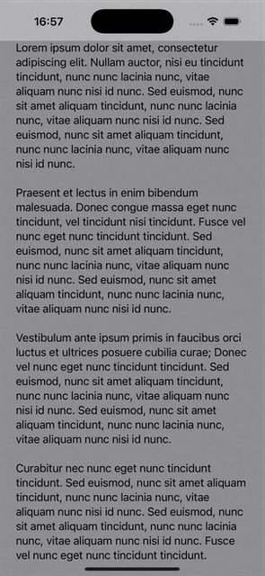

# 🎨 SwiftUI Solid Status Bar



# StatusBarBackgroundFix

A minimal SwiftUI component that ensures the status bar remains visible and readable when using `ScrollView` or similar views. On certain layouts, content may scroll beneath the system status bar, making it hard to read system information such as the time or battery level. This component overlays a background beneath the status bar to maintain visibility.

## Features

- Adds a background (e.g., `Material` or `Color`) behind the system status bar.
- Works with any SwiftUI view hierarchy.
- Automatically handles safe area insets.
- Lightweight and easy to integrate.

## Usage

Wrap your content in the `StatusBar` view:

```swift
import SwiftUI

struct ContentView: View {
    var body: some View {
        StatusBar(Material.ultraThin) {
            ScrollView {
                VStack(alignment: .leading) {
                    Text("Your content here...")
                }
                .padding(.horizontal, 24)
            }
            .frame(maxWidth: .infinity)
            .background(Color(uiColor: .systemGray))
        }
    }
}
